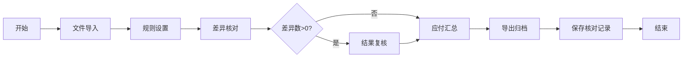

## 1. 产品概述

公路运输运费核对自动化工具，面向物流财务人员，提供承运账单批量检查功能。通过导入多维度数据（运单、回单、油卡、过路费、报价），按业务规则自动核对，识别差异问题，提升对账效率和准确性。

- 解决物流行业人工对账效率低、易出错、追溯难的痛点
- 目标用户：物流财务人员、结算专员、运营管理人员

## 2. 核心功能

### 2.1 用户角色

| 角色 | 注册方式 | 核心权限 |
|------|----------|----------|
| 财务人员 | 系统账号 | 导入数据、设置规则、执行核对、复核结果、导出报表 |
| 管理员 | 系统账号 | 全部功能 + 历史记录管理 + 用户管理 |

### 2.2 功能模块

1. **文件导入**：支持运单、回单、油卡、过路费、承运商报价五类文件的批量导入
2. **规则设置**：按线路、车型、重量、里程配置计费规则和核对规则
3. **差异核对**：自动匹配运单，识别缺少回单、重复运单、超报价、费用未分摊等问题
4. **结果复核**：人工确认差异、添加备注原因、调整应付金额
5. **导出归档**：导出对账表，保留核对历史记录，支持追溯查询

### 2.3 页面详情

| 页面名称 | 模块名称 | 功能描述 |
|----------|----------|----------|
| 工作台 | 概览面板 | 核对进度统计、待处理事项、历史记录快捷入口 |
| 文件导入 | 文件上传区 | 拖拽上传、文件类型识别、导入进度、数据预览 |
| 规则设置 | 计费规则配置 | 线路管理、车型配置、重量阶梯价、里程单价设置 |
| 规则设置 | 核对规则配置 | 容差设置、异常判定条件、匹配优先级 |
| 差异核对 | 核对引擎 | 一键核对、匹配状态、差异分类统计 |
| 差异核对 | 差异清单 | 问题类型筛选、批量处理、详情查看 |
| 结果复核 | 复核工作台 | 人工确认、备注添加、金额调整、批量通过 |
| 结果复核 | 应付汇总 | 按承运商汇总、金额统计、对账明细 |
| 导出归档 | 导出中心 | 多种格式导出、自定义导出字段 |
| 导出归档 | 历史记录 | 核对历史列表、详情查看、记录对比 |

## 3. 核心流程

用户进入工作台，依次完成五个步骤：导入五类文件 → 配置或选择计费规则 → 执行自动核对 → 人工复核差异 → 导出对账表并归档。系统自动保存每次核对记录，支持随时回溯。

## 4. 用户界面设计

### 4.1 设计风格

- **主色调**：深海蓝（#0F4C81）- 专业、稳重、信任感
- **辅助色**：琥珀橙（#F59E0B）- 警示、强调、操作提示
- **成功色**：翡翠绿（#10B981）- 通过、正常
- **危险色**：珊瑚红（#EF4444）- 异常、错误
- **中性色**：冷灰系列 - 页面背景、文字、边框
- **按钮风格**：微圆角（6px）、轻微投影、悬停上浮效果
- **字体**：标题使用思源黑体 Bold，正文使用思源黑体 Regular，数字使用等宽字体
- **布局风格**：左右分栏 + 卡片式布局，顶部步骤导航
- **图标风格**：线性图标，统一2px描边，圆角风格

### 4.2 页面设计概览

| 页面名称 | 模块名称 | UI 元素 |
|----------|----------|----------|
| 工作台 | 概览面板 | 统计卡片、进度条、快捷操作区、最近记录列表 |
| 文件导入 | 文件上传区 | 拖拽区域、文件卡片、进度条、预览表格、步骤指示器 |
| 规则设置 | 规则配置 | Tab切换、表单分组、规则列表、增删改操作、开关控件 |
| 差异核对 | 差异清单 | 筛选栏、数据表格、标签分类、状态徽章、分页器 |
| 结果复核 | 复核工作台 | 左右分栏、差异详情、备注输入框、确认/驳回按钮 |
| 导出归档 | 历史记录 | 时间轴布局、记录卡片、详情展开、对比视图 |

### 4.3 响应式

- 桌面端优先设计（1440px 基准）
- 支持 1024px~1920px 宽屏自适应
- 数据表格支持横向滚动
- 关键操作按钮始终可见

### 4.4 动效设计

- 步骤切换：平滑滑动过渡
- 文件上传：进度条动画 + 成功勾选动效
- 差异出现：逐行淡入 + 轻微上浮
- 按钮交互：悬停缩放 + 阴影加深
- 数据加载：骨架屏占位 + 内容渐入
