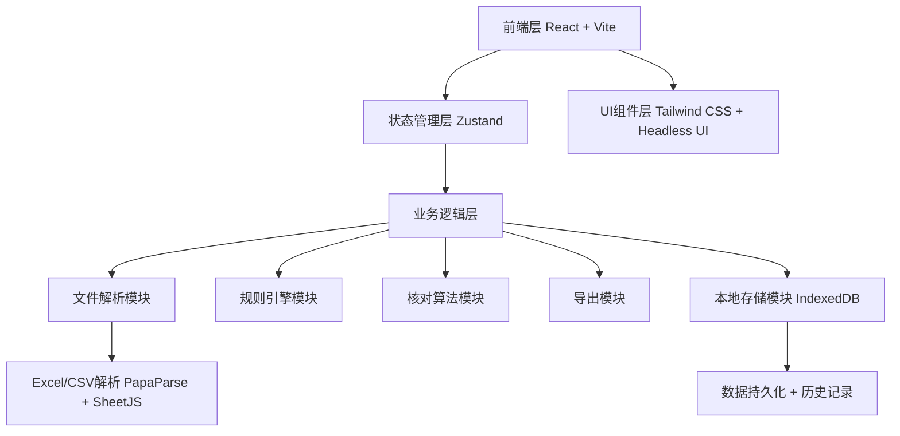
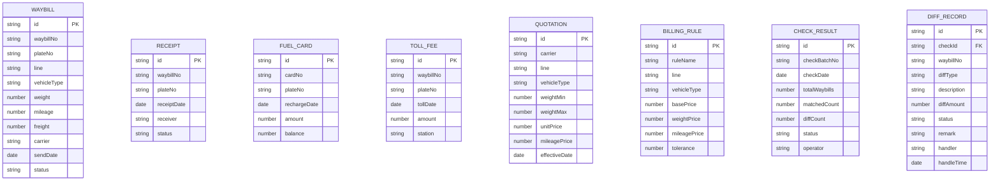

## 1. 架构设计



## 2. 技术描述

- **前端框架**：React@18 + TypeScript
- **构建工具**：Vite@5
- **样式方案**：Tailwind CSS@3
- **状态管理**：Zustand
- **UI组件库**：Headless UI + Heroicons
- **文件解析**：PapaParse (CSV) + xlsx (Excel)
- **数据导出**：xlsx + file-saver
- **本地存储**：IndexedDB (via Dexie.js)
- **图表展示**：Recharts
- **后端**：无后端纯前端方案，数据全部本地处理
- **数据库**：IndexedDB 本地存储，支持历史记录追溯

## 3. 路由定义

| 路由 | 用途 |
|------|------|
| /dashboard | 工作台/首页 |
| /import | 文件导入 |
| /rules | 规则设置 |
| /check | 差异核对 |
| /review | 结果复核 |
| /export | 导出归档 |

## 4. 数据模型

### 4.1 数据模型定义



### 4.2 核心数据类型定义

```typescript
// 运单
interface Waybill {
  id: string;
  waybillNo: string;
  plateNo: string;
  line: string;
  vehicleType: string;
  weight: number;
  mileage: number;
  freight: number;
  carrier: string;
  sendDate: string;
  status: 'pending' | 'completed' | 'abnormal';
}

// 回单
interface Receipt {
  id: string;
  waybillNo: string;
  plateNo: string;
  receiptDate: string;
  receiver: string;
  status: 'confirmed' | 'pending';
}

// 油卡记录
interface FuelCardRecord {
  id: string;
  cardNo: string;
  plateNo: string;
  rechargeDate: string;
  amount: number;
  balance: number;
}

// 过路费
interface TollFee {
  id: string;
  waybillNo: string;
  plateNo: string;
  tollDate: string;
  amount: number;
  station: string;
}

// 报价单
interface Quotation {
  id: string;
  carrier: string;
  line: string;
  vehicleType: string;
  weightMin: number;
  weightMax: number;
  unitPrice: number;
  mileagePrice: number;
  effectiveDate: string;
}

// 计费规则
interface BillingRule {
  id: string;
  ruleName: string;
  line: string;
  vehicleType: string;
  basePrice: number;
  weightPrice: number;
  mileagePrice: number;
  tolerance: number;
}

// 核对记录
interface CheckRecord {
  id: string;
  checkBatchNo: string;
  checkDate: string;
  totalWaybills: number;
  matchedCount: number;
  diffCount: number;
  status: 'pending' | 'reviewing' | 'completed';
  operator: string;
  remark?: string;
}

// 差异记录
interface DiffRecord {
  id: string;
  checkId: string;
  waybillNo: string;
  plateNo: string;
  carrier: string;
  diffType: DiffType;
  description: string;
  expectedAmount: number;
  actualAmount: number;
  diffAmount: number;
  status: 'pending' | 'confirmed' | 'rejected' | 'adjusted';
  remark: string;
  handler?: string;
  handleTime?: string;
}

type DiffType = 
  | 'missing_receipt'
  | 'duplicate_waybill'
  | 'exceed_quotation'
  | 'fee_unallocated'
  | 'mileage_mismatch'
  | 'weight_mismatch'
  | 'other';
```

## 5. 核心模块设计

### 5.1 文件解析模块

- 支持 Excel (.xlsx, .xls) 和 CSV 格式
- 自动识别文件类型和表头
- 数据校验和格式转换
- 导入进度反馈和错误提示

### 5.2 核对引擎模块

- 运单号 + 车牌号双重匹配
- 回单缺失检测
- 重复运单检测
- 报价超支计算
- 费用分摊校验
- 重量/里程差异比对

### 5.3 规则引擎模块

- 线路维度计费
- 车型维度计费
- 重量阶梯计费
- 里程计费
- 容差规则配置
- 优先级匹配

### 5.4 导出模块

- 支持 Excel 格式导出
- 自定义导出字段
- 对账汇总表生成
- 差异明细导出

### 5.5 历史记录模块

- 核对记录自动保存
- 按时间/批次号查询
- 记录详情查看
- 历史对比功能
